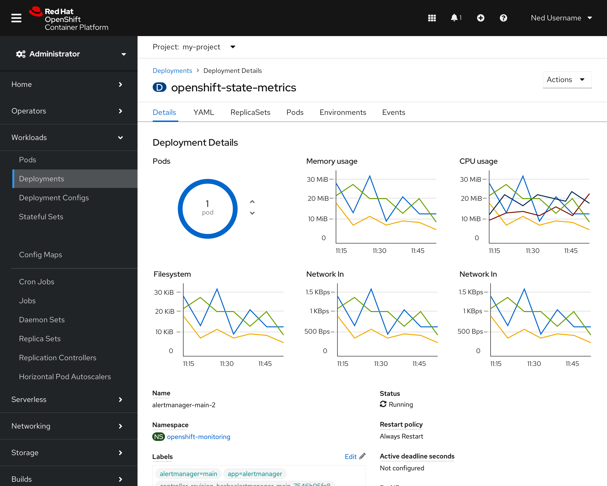

---
parent: Administrator
version: 4.8
---

# **Workloads: Utilization Charts **

Reported issues:

[https://issues.redhat.com/browse/PD-662](https://issues.redhat.com/browse/PD-662)

[https://issues.redhat.com/browse/CONSOLE-2384](https://issues.redhat.com/browse/CONSOLE-2384)

Marvel prototype (4.8 release):

[https://marvelapp.com/prototype/fg10a04/screen/75532540](https://marvelapp.com/prototype/fg10a04/screen/75532540)

Link to Google doc: 
[https://docs.google.com/document/d/1GdMapBB-WnTwQx3zJTlxU8qfrM24BSqf4j4TBeK68S0/edit?usp=sharing](https://docs.google.com/document/d/1GdMapBB-WnTwQx3zJTlxU8qfrM24BSqf4j4TBeK68S0/edit?usp=sharing)

# Background

When moving to OCP 4 metrics charts for Deployments, Deployment Configs, StatefulSets, DaemonSets, ReplicaSets, and ReplicationControllers. These should be the same charts that we show on the Pods page: Memory, CPU, Filesystem, Network In and Out. Currently, in the 4.7 release, this was only completed for the Pods page.

## Goal

Present options including multi-line charts across workloads Details pages or some other representation.

## Design for 4.8 release (MVP)

The first screenshot (below) introduces multi-line charts on a Deployments page. The Pods view remains the first option as it is an interactive feature that allows users to scale pods within a deployment. The multi-line charts have a tooltip available on hover that can click through to a Grafana metrics view.

The second screenshot includes a legend for each chart to help distinguish between datasets. 

